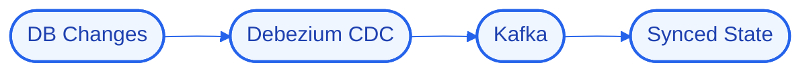

# Architecture — StreamState

## High-Level Design (HLD)
StreamState captures row-level changes from Postgres with Debezium and streams them through Kafka, keeping downstream stores and caches in sync without dual-writes.

**Flow:** DB Changes → Debezium CDC → Kafka → Synced State

## Low-Level Design (LLD)
- **Components:** `Debezium`, `Kafka`, `Postgres`
- **Interfaces / contracts:** to be finalized during implementation.
- **Data model:** to be defined per component.

## Decision Log
- **Why this stack:** **Debezium** — change-data-capture connector; **Kafka** — durable event-streaming backbone; **Postgres** — relational source of truth.
- **Antigravity constraint:** run logic/state/UI locally; offload heavy reasoning to cloud APIs; target modest hardware.

## Concept Deep Dive
Capturing changes from the write-ahead log so sync is consistent and non-intrusive.
